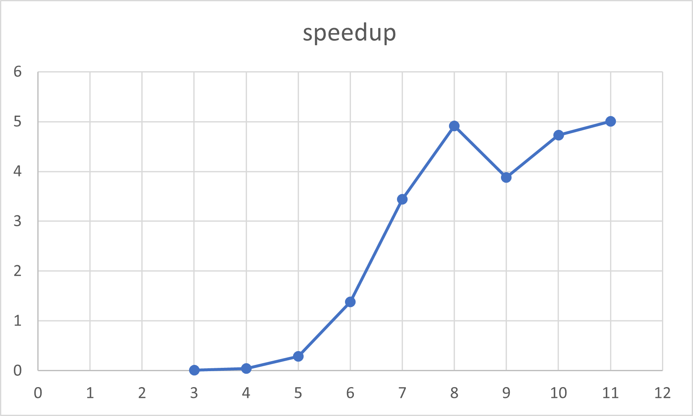

# Parallel Determinant
This is a university project.

## General 
We decided to implement **Laplace's expansion theorem** as it can compute the determinant for matrizes with dimension > 3. 
Laplace's theorem has a complexity of **O(n!)** therefore we can not test our solution with very big dimensions, unless we wait very long.
One alternative would have been to use the Gaussian elimination algorithm which has better complexity, with approximately **0(n^3)**, but can not be parallelized as good as the laplace expansion theorem.

## Hardware
Intel i7-9750H @2.6GHz; 6 physical cores/12 logical cores

## Test Data
We calculate the determinant for a **11-dimensional** matrix.

## Speed Sequential Solution
Average Speed of 10 runs with the Test Data: **454.45ms**.

## Speed Naive Parallel Solution 
Average Speed of 10 runs with the Test Data: **56450.4ms** or **56.45s**.  
That is **124.22** times slower than the sequential solution.

After implementing our parallel solution via OpenMP's Tasks and playing around with it a bit it quickly became clear that the naive parallel solution
is slower than the sequential solution (by a lot). Creating a task for every Sub-Matrix
leads to **Over-Subscription** which in turn makes our solution slower(just like in ParallelSort).

## Thresholds
To solve the problem of **Over-Subscription** we decided to set thresholds. In our case we want to start executing sequentially as soon as we hit a certain dimension of the matrix.
As the termination condition of our recursion is reaching two dimensions (as we can calculate the determinant easily with **a * d - c * b**) the **smallest threshold** 
that would make any difference is **3**.
As we test with 11 dimensions the **largest threshold** making sense (to still compute anything in parallel) is **11**.

## Speed with Thresholds
We took the average of 10 executions for a 11-dimensional matrix for the thresholds from 3-11 and wrote the results to a csv. We also compared the speed for each threshold
with the speed of the sequential solution (also average of 10 executions for 11-dimensional).
This allowed us to create the following graph:

As the difference in execution time is so large we look at the graph for threshold 6-11 explicitly:

Now we see that the fastest execution time was reached with a threshold of 11. Which makes sense as it creates 10 Tasks for the Sub-Matrices which leads
to the least Over-Subscription.

Again we see that the speedup at threshold 11 is best..
